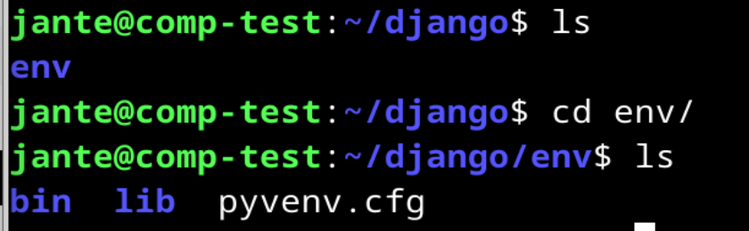
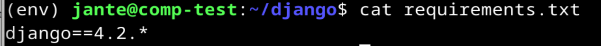
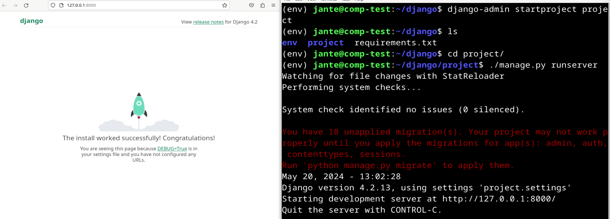
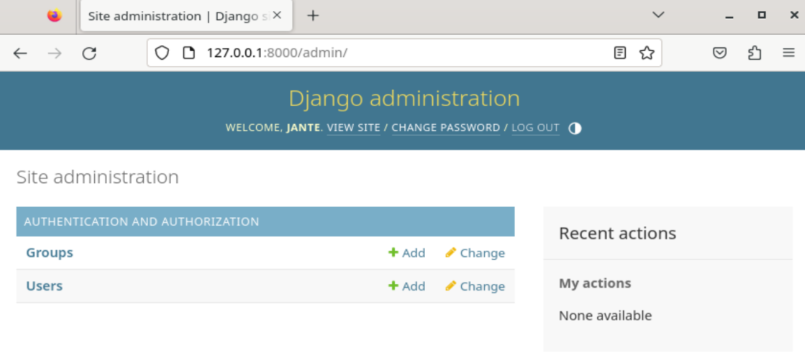
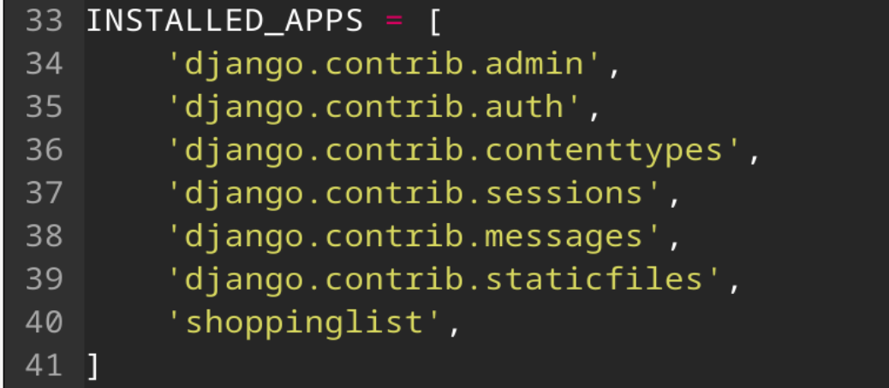
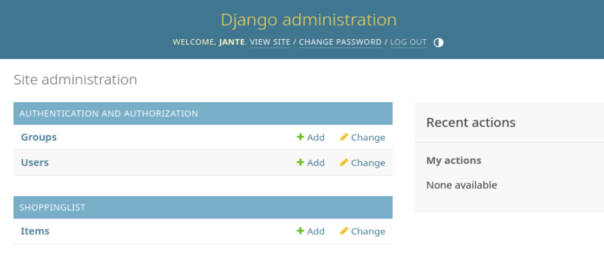
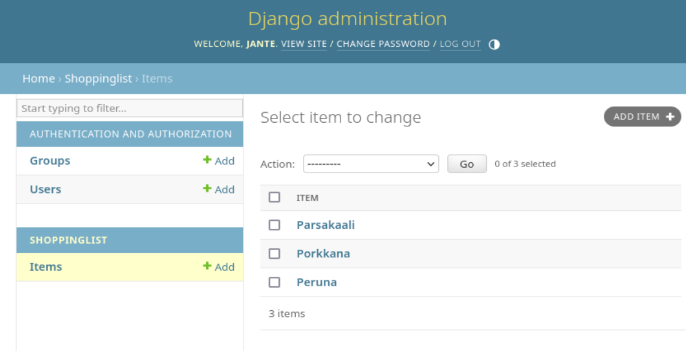

# Django

Asennus virtuaalikoneelle Linux Debian 12 Bookworm, joka pyörii VirtualBoxissa. Host OS:nä toimii Mac OS Sonoma 14. Koneen tarkemmat speksit löytyvät repositorion README-tiedostosta: https://github.com/janteH/django-python-course/blob/main/README.md

Pakettien päivitys:

    sudo apt-get update

Projektikansion luonti kotihakemistoon:

    mkdir django
    cd django

Virtualenvin asennus:

    sudo apt-get -y install virtualenv

Uuden virtualenvin ympäristön luonti:

    virtualenv -p python3 --system-site-packages env

Näyttää kansiossa nyt tältä:

Ympäristön käynnistys:

    source env/bin/activate

Tarkistus komennolla, että pip asentaa tavarat luotuun projektikansioon eikä koneen yleisiin kansioihin:

    which pip

Luodaan tiedosto, johon kirjoitetaan pipillä asennettavat tavarat:

    micro requirements.txt

Tiedoston sisällöksi:

    django 4.2.*

Catilla vielä tuplatarkistus, että ei ole kirjoitusvirheitä:

    cat requirements.txt

Pipillä  djangon asennus:

    pip install -r requirements.txt

Uuden projektin luonti:

    django-admin startproject project
    cd project

Projektin käynnistys:

    ./manage.py runserver

## Django Admin interface

Tietokannan päivitys:

    ./manage.py makemigrations
    ./manage.py migrate

Superkäyttäjän luonti:

    ./manage.py createsuperuser

Määritetään käyttäjän nimi, sähköposti ja hyvä salasana.

Käynnistetään palvelin:

    ./manage.py runserver

Kirjaudutaan tunnuksella admin sivulle 127.0.0.1:8000/admin

## Django Apps

Uuden appsin 'shoppinglist' luonti:

    ./manage.py startapp shoppinglist

Lisätään appien listaan:

    micro project/settings.py

Mallien lisäys:

    micro shoppinglist/models.py 

Tiedostoon:

    from django.db import models
    
    class Item(models.Model):
       name = models.CharField(max_length=300)

Tietokannan päivitys:

    ./manage.py makemigrations
    ./manage.py migrate

Tietokannan rekisteröinti:

    micro shoppinglist/admin.py

Tiedostoon:

    from django.contrib import admin
    from . import models
    
    admin.site.register(models.Items)

Admin sivulla näkyy nyt uusi appsi Shoppinglist, jossa Items taulu:

Lisätään Items tauluun pari objektia ja muutetaan näkyvyys niin, että objektin nimi tulee oletuksena tauluun näkyviin.

    micro shoppinglist/models.py

Tiedostoon lisätään:

    def __str__(self):
        return self.name

###### Lähteet

Deploy Django 4 - Production Install. Terokarvinen.com. Luettavissa: https://terokarvinen.com/2022/deploy-django/?fromSearch=django. Luettu: 20.5.2024.

Django 4 Instant Customer Database Tutorial. Terokarvinen.com. Luettavissa: https://terokarvinen.com/2022/django-instant-crm-tutorial/?fromSearch=django. Luettu: 20.5.2024.

Djangon testiasennus. Github:janteH. Luettavissa: https://github.com/janteH/linux-course/blob/main/h6/django.md#django-testiasennus. Luettu: 20.5.2024.
